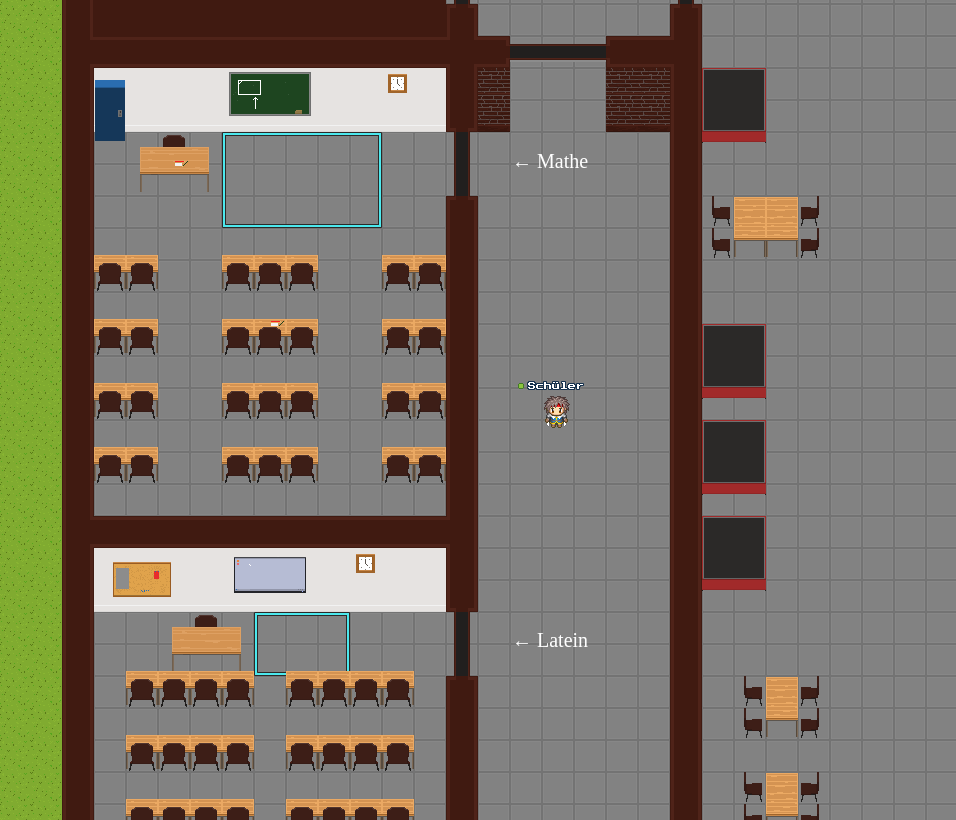

# Kolleg St. Thomas Workadventure



Diese Karte repräsentiert das Kolleg St. Thomas als Workadventure für den Tag der offenen Tür.

## Credits
Karte erstellt von https://github.com/suri909

Karten-Template von https://github.com/thecodingmachine/workadventure-map-starter-kit

## Bearbeiten der Karte
Die Github Repository ist in ein Master-Branch und einen Develop-Branch unterteilt. Änderungen erfolgen immer im Develop-Branch, können dann getestet werden (siehe Testing) und können, wenn alles fertig ist, mit einem Pull-Request in den Master-Branch überführt werden. Die Karte des Master-Branches wird standardmäßig beim Aufruf von https://play.adventure.kst-vechta.de gestartet.

### Git-Umgebung
Die aktuellste Version von Git für Windows kann unter folgendem Link herunterladen und installiert werden: https://git-scm.com/downloads
Es empfiehlt sich die Verwendung der Git-Bash, da die GUI teilweise etwas merkwürdig ist und man mit der Git-Bash viele Anleitungen im Internet findet, wenn etwas nicht funktioniert. Die Git-Bash kann im aktuellen Ordner geöffnet werden, indem man ein Rechtsklick -> Git Bash aufruft. Es öffnet sich ein Konsolenfenster in denen die gängigen Linux Befehle funktionieren.

```
cd <Ordner> # (Change Directory) Um in einen Ordner zu wechseln
cd .. # Um in den übergeordneten Ordner ("zurück") zu wechseln
mkdir <Ordner> # (Make Directory) Um einen Ordner mit dem angegebenen Namen zu erstellen
ls # (List) Um alle Dateien im aktuellen Ordner anzuzeigen
```

### Herunterladen der Repository und Wechseln in den develop Branch
Öffnet die Git-Bash in dem Ordner, in der die Repository heruntergeladen werden soll. In der Konsole gebt ihr die folgenden Befehle ein:

```
# "git clone" klont die Repository vom Online Github auf euer lokales System
git clone https://github.com/Kolleg-St-Thomas/workadventure-map.git

# Im Anschluss mit dem Befehl cd in die Repository wechseln
cd workadventure-map
```

In dieser Repository existieren verschiedene Branches. Ein Branch ist im Grunde ein anderer Versionsstand mit anderen Änderungen. Ein Versionsstand kann in einen anderen Versionsstand überführt werden, sprich man kann ein Branch in ein anderen Branch mergen (siehe Version in Master überführen). Um sich die vorhandenen Branches anzuzeigen gibt es den folgenden Befehl:

```
git branch -a
* master
  remotes/origin/HEAD -> origin/master
  remotes/origin/develop
  remotes/origin/master
```

Man sieht anhand des Sternchens, dass man sich aktuell im Branch "master" befindet, sprich im Produktivstand. Außerdem ist sichtbar, dass "remote", sprich auf dem Github-Server noch ein Branch "develop" existiert. Das "origin" ist im Grunde nur ein Alias für die URL, wo die Repository auf dem Github-Server liegt (kann man sich mit git remove -v anschauen). Um den "develop" Branch zu laden, kann man folgenden Befehl nutzen:

```
# In den Branch develop wechseln
git checkout develop

# Der git branch -a Befehl zeigt anhand des Sternchens nun, dass ihr im develop Branch seit.
git branch -a
* develop
  master
  remotes/origin/HEAD -> origin/master
  remotes/origin/develop
  remotes/origin/maste
```

Die Karte kann jetzt kann normal mit dem Tiled-Editor bearbeitet werden.

### Änderungen einer Version comitten
**Hinweis:** Der große Vorteil von Git ist die Versionskontrolle, sprich man kann immer genau nachvollziehen, wer welche Änderungen durchgeführt hat. Aus diesem Grund sollte man nach wenigen Änderungen immer wieder ein Commit mit einer aussagekräftigen Beschreibung durchführen, sodass man im Fehlerfall schnell wieder auf eine vorherige Version zurück wechseln kann. Das ganze wird an einem Beispiel deutlich:

```
# Karte wurde bearbeitet. Durch ein git commit sichere ich die Änderungen und beschreibe meine Änderungen
git commit -am "Startposition wurde an eine neue Position gesetzt"

# Ich bearbeite die Karte wieder
git commit -am "Alle Video-URLs wurden ausgetauscht"
```

Wenn man neue Dateien hinzufügt, so muss man git sagen, dass er Änderungen an den neuen Dateien verfolgen soll, **bevor** man commited. Dazu gibt es den git add Befehl
```
# Entweder eine genaue Datei angeben
git add <Dateiname>

# Oder alle neuen Dateien verfolgen
git add .

# Im Anschluss comitten
git commit -am "Neue Dateien hinzugefügt"
```

Möchte man sich anschauen, welche Dateien verändert wurden, kann man den git status Befehl verwenden. Um die genauen Änderungen anzuzeigen, nutzt man den git diff Befehl. Beide müssen **vor** den Commit ausgeführt werden. Diese Befehle helfen, damit man kein Quatsch committed.
```
# Dateiänderungen anzeigen
git status

# Änderungen anzeigen
git diff
```

### Hochladen der aktuellen Version
Um seine lokale Versionshistorie mit mehreren Commits hochzuladen, kann man den Befehl git push verwenden. Ein git push **kann** nach jedem Commit ausgeführt werden, **muss** es aber nicht. Man kann auch 5-mal committen und pusht dann alle 5 Änderungen gleichzeitig auf den Github-Server. Wichtig ist nur, dass man nach dem beenden der Arbeit ein git push ausführt. Ansonsten kann es passieren, dass in der Zwischenzeit jemand anderes pusht und man die verschiedenen Versionsstände nicht mehr so einfach zusammengeführt bekommt (Mergekonflikt)

```
# Origin ist hierbei der Alias zur Github Repository und develop ist der Branch, indem wir unsere lokalen Änderungen hochladen wollen
git push -u origin develop
```

### Herunterladen von Änderungen
Bevor man an seinen Änderungen weiterarbeitet, sollte man immer ein git pull ausführen. Mit git pull werden Änderungen, die eventuell jemand anderes hochgeladen hat, mit der lokalen Version zusammengeführt (merging). Wenn man vor beginn seiner Arbeit kein git pull ausführt, kann es zu einem Mergekonflikt kommen (siehe https://www.atlassian.com/git/tutorials/using-branches/merge-conflicts)


```
# Aktuelle Version vom Github-Server herunterladen, sofern jemand anderes bereits weitergearbeitet hat
git pull
```

### Testing
Die Github Repository ist so konfiguriert, das alle Änderungen in develop automatisch mittels Github-Actions auf dem Workadventure-Server hochgeladen werden. Die Datei findet man hier: https://map-storage.adventure.kst-vechta.de/. Die aktuelle develop Version kann über folgenden Link gespielt werden: https://play.adventure.kst-vechta.de/_/global/map-storage.adventure.kst-vechta.de/develop/map.json